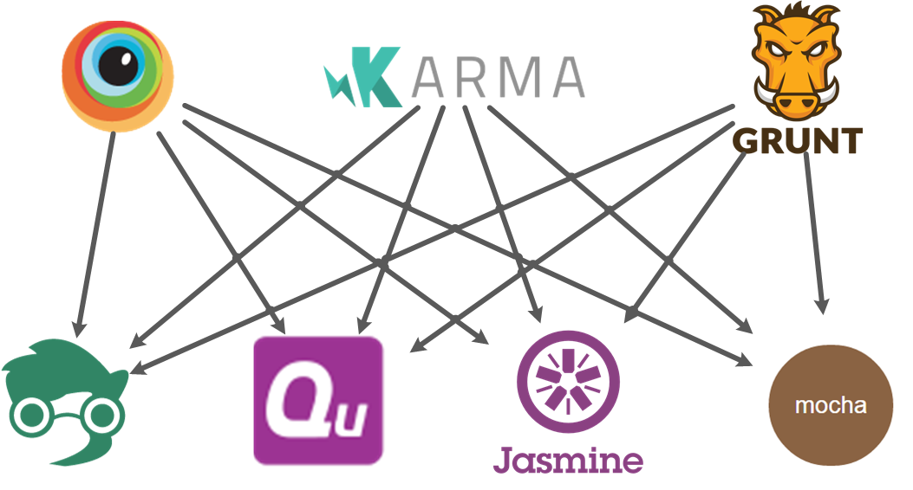
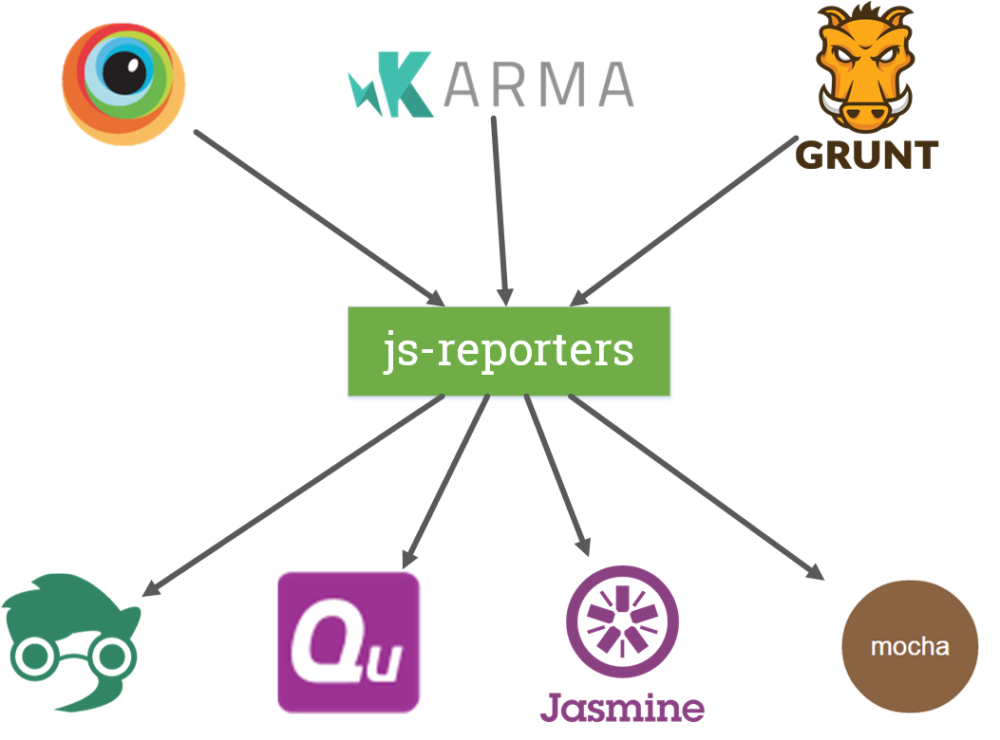

# js-reporters

[](https://travis-ci.org/js-reporters/js-reporters)
[](https://www.npmjs.com/package/js-reporters)
[](https://www.npmjs.com/package/js-reporters)
[](https://www.npmjs.com/package/js-reporters)

The Common Reporter Interface (CRI) for JavaScript Unit Testing Frameworks.

| Avoid this:                | Do this:                         |
|----------------------------|----------------------------------|
|  |   |

## Centralized Discussions

https://github.com/js-reporters/js-reporters/issues/

## Background

We on the [QUnit](http://qunitjs.com/) team have been [discussing](https://github.com/qunitjs/qunit/issues/531) the possibility of working with other JS test frameworks, especially those that can be run client-side (e.g. Mocha, Jasmine, Intern, Buster, etc.), to agree upon a "Common Reporter Interface" so that we could hopefully share Reporter plugins between testing frameworks. This would also benefit high-level consumers of the frameworks such as Karma, BrowserStack, SauceLabs, Testling, etc.

This would most likely come in the form of:

- a common Reporter API/Interface, e.g.
  - an EventEmitter interface (`.on(...)`/`.off(...)`) _**OR**_ an object with standard "hook" properties
  - _maybe_ a standard-ish way to register a Reporter, e.g. `MyLib.addReporter(x)`, `MyLib.reporter = x;`, etc.
- a minimum viable set of standardly-named events
  - an associated standard set of data/details provided for each event
- a minimum viable set of standard test status types (e.g. pass, fail, skip, todo, pending, etc.)
- updating all participating test frameworks to support this new common Reporter interface

Would _you_ be interested in discussing this with us further? Please join in!

## Draft Proposal

### Event Names

Based on the discussion in [#1](https://github.com/js-reporters/js-reporters/issues/1#issuecomment-54841874), this is the suggested _minimum_ set of event names to be triggered by a testing framework, to be consumed by reporters or other testing tools.

- `runStart`: Indicates the beginning of a testsuite, triggered just once.
- `suiteStart`: Triggered at the start of each group of tests within a testsuite.
- `testStart`: Triggered at the start of each test.
- `testEnd`: Triggered at the end of each test.
- `suiteEnd`:  Triggered at the end of each group of tests within a testsuite.
- `runEnd`:  Indicates the end of a testsuite, triggered just once.

#### Selection Criteria

The criteria for picking these event names included:

- These use the most common terms across a selection of frameworks, as gathered in [#1](https://github.com/js-reporters/js-reporters/issues/1#issuecomment-54841874)
- It uses names that are valid JavaScript identifiers, which allows using those as keys in JSON and avoids the need to quote keys in regular JS objects or function calls.
- It doesn't overlap with any known existing events, so introducing these could be done in parallel to the existing API in each framework, optionally deprecating and eventually removing the previous API.

#### Reporting Order

The recommended **reporting order** for emitting the aformentioned events with their related data should be done in **source order**. Please note that execution order is different from reporting order, that's why we don't assume any specific execution order, but we recommend whatever is higher up in the source file should be emitted first.

For more background check [#62](https://github.com/js-reporters/js-reporters/issues/62).

### Event Data

Based on the discussion in [#12](https://github.com/js-reporters/js-reporters/issues/12#issuecomment-120483356), there are two basic data structures: **Suites** and **Tests**. A test represents an atomic test/spec/`it()`. A suite contains tests and optionally other suites.

The structures have been divided in two parts, a start part and an end part:

- SuiteStart
- SuiteEnd
- TestStart
- TestEnd

For `testStart` and `testEnd`, the corresponding TestStart, respectively TestEnd, object is passed to the reporter. The same applies to `suiteStart` and `suiteEnd` where the matching SuiteStart/SuiteEnd object is passed to the reporter. For `runStart` and `runEnd` a "global" suite object is passed to the reporter, this suite wraps all other top-level user defined suites as its child suites, it will be reffered to as `globalSuite`.

The data structures are defined as follows:

- **SuiteStart**: `Object` - A SuiteStart is a collection of test-starts and potentially other suite-starts, emitted before the suite have been executed, which means before executing any of its tests and child suites.
  - **name**: `String|undefined` - name of the suite, will be `undefined` only for the `globalSuite`.
  - **fullname**: `Array` - array of strings containing the name of the suite and the names of all its suites ancestors.
  - **tests**: `Array` - array containing all tests that directly belong to the suite (but not to a child suite).
  - **childSuites**: `Array` - array with all direct subsuites.
  - **testCounts**: `Object` - contains the total number of tests in the suite, including the tests of the child suites.
    - **total**: `Number` - total number of tests

- **SuiteEnd**: `Object` - A SuiteEnd is a collection of test-ends and potentially other suite-ends, emitted after the suite has been executed, which means that all its tests and child suites have been also executed. **In addition** to the properties of `SuiteStart`, `SuiteEnd` also has the following properties:
  - **status**: `String` - summarized status of the suite.
    - `failed`, if at least one test in the suite or in its child suites has failed.
    - `skipped`, if all tests in the suite and in its child suites are skipped (and there is at least one skipped test).
    - `todo`, if all tests in the suite and in its child suites are todo (and there is at least one todo test).
    - `passed`, if there is at least one passed test in the suite or in its child suites and all other tests are skipped or todo, or if there are no tests in the suite.
  - **testCounts**: `Object` - contains how many tests have passed, failed etc. including the tests of child suites.
    - **passed**: `Number` - number of passed tests.
    - **failed**: `Number` - number of failed tests.
    - **skipped**: `Number` - number of skipped tests.
    - **todo**: `Number` - number of todo tests.
    - **total**: `Number` - total number of tests, the sum of the above properties must equal this one.
  - **runtime**: `Number` - execution time of the whole suite in milliseconds (including child suites).

The above `suite properties` apply also for the `globalSuite`.

- **TestStart**: `Object` - A test-start holds basic information on a single test/spec before its execution.
  - **name**: `String` - name of the test.
  - **suiteName**: `String` - name of the suite the test belongs to.
  - **fullName**: `Array` - array of strings containing the name of the test and the names of all its suites ancestors.1

- **TestEnd**: `Object` - A test-end holds basic information on a single test/spec after its execution.
  - **name**: `String` - name of the test.
  - **suiteName**: `String` - name of the suite the test belongs to.
  - **fullName**: `Array` - array of strings containing the name of the test and the names of all its suites ancestors.
  - **status**: `String` - result of the test. Can be:
    - `passed`, if all assertions have passed.
    - `failed`, if at least one assertion has failed or if the test is todo and all assertions passed.
    - `skipped`, if the test is disabled and wasn't executed.
    - `todo`, if the test is todo and at least one assertion failed.*
  - **runtime**: `Number` - execution time in milliseconds.
  - **errors**: `Array` - array containing all errors, i.e failed Assertions. It will contain at least one error for failed statuses and it will be empty for statuses other than failed.
  - **assertions**: `Array` - array of Assertions containing all assertions passed and failed, for a skipped test there will be an empty array. Frameworks that don't track passed assertions can always provide an empty array for passed tests. In that case, for failed tests this should match the errors property.

_*For more info about todo tests, please refer to the [QUnit documentation for todo tests](https://api.qunitjs.com/QUnit.todo/) and the [TAP 13 specification on the todo directive](https://testanything.org/tap-version-13-specification.html#directives)_.

Based on the discussion in [#79](https://github.com/js-reporters/js-reporters/issues/79), js-reporters establishes also a minimum set of properties for the emitted assertions, failed or passed:

- **Assertion**: `Object` - An object which contains information of a single assertion/expectation.
  - **passed**: `Boolean` - `true` for a passed assertion, `failed` for a failed assertion.
  - **actual**: `*` - the actual value passed to the assertion, should coincide with `expected` for passed assertions.
  - **expected**: `*` - the expected value passed to the assertion, should coincide with `actual` for passed assertions.
  - **message**: `String` - a description.
  - **stack**: `String|undefined` - represents the stack trace for a failed assertion, for a `passed` one it is `undefined`.
  - **todo**: `Boolean` - whether this assertion was part of a todo test

Additional properties (not defined here) can be added to the Assertion object. If Assertion objects are included in the Test and Suite objects defined above, it is recommended to remove the `actual` and `expected` values after `TestEnd` occurs to avoid leaking memory.

## Details

For details please check out the [docs](docs) and especially the [example](docs/example.md) which presents a testsuite and its reporting data based on the standard presented above.

For implementation examples please check [Usage of the adapters](#usage-of-the-adapters) and [Integrations](#integrations).

## Usage of the adapters

Listen to the events and receive the emitted data:

```js
// Attach one of the exiting adapters.
var runner = JsReporters.autoRegister();

// Listen to the same events for any testing framework.
runner.on('testEnd', function(test) {
  console.log('Test %s has errors:', test.fullname.join(' '), test.errors);
});

runner.on('runEnd', function(globalSuite) {
  var testCounts = globalSuite.testCounts;

  console.log('Testsuite status: %s', globalSuite.status);

  console.log('Total %d tests: %d passed, %d failed, %d skipped',
    testCounts.total,
    testCounts.passed,
    testCounts.failed,
    testCounts.skipped);

  console.log('Total duration: %d', globalSuite.runtime);
});

// Or use one of the built-in reporters.
JsReporters.TapReporter.init(runner);
```

## API

**autoRegister()**

Auto registers one of the existing adapters by checking for existing testing frameworks in the global scope and returns the runner to attach event listeners. If no framework is found, it will throw an `Error`.

```js
JsReporters.autoRegister();
```

## Integrations

- [browserstack-runner](https://github.com/browserstack/browserstack-runner/blob/master/lib/_patch/reporter.js)

## Differences

This section is dedicated to explain the limitations of the adapters in respect to the standard.

The only limitation is the emitting order, which is not done in source order:

- Jasmine: the emitting order of the tests will be the one from Jasmine
- Mocha: the emitting order of the tests will be the one from Mocha
- QUnit: the emitting order is done in suite order, which means if there is a suite that contains tests and other suites, it emits the start of the suite and then emits its tests and only after it emits the other suites, even if the tests were the last in source order

If you want to know more about each testing framework and about their emitting order, please checkout the [frameworks](docs/frameworks.md) document.

## Cross-Reference Issues

### Unit Testing Frameworks

- https://github.com/qunitjs/qunit/issues/531  (original discussion)
- https://github.com/visionmedia/mocha/issues/1326
- https://github.com/pivotal/jasmine/issues/659
- https://github.com/theintern/intern/issues/257
- https://github.com/busterjs/buster/issues/419
- https://github.com/caolan/nodeunit/issues/276
- https://github.com/flatiron/vows/issues/313

### Consuming Services

- https://github.com/browserstack/browserstack-runner/issues/92
- https://github.com/axemclion/grunt-saucelabs/issues/164
- https://github.com/karma-runner/karma/issues/1183
- https://github.com/substack/testling/issues/93
